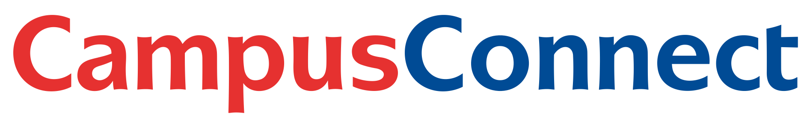

  
  <h1 align="center">Your Central Hub for Secure Campus Interactions and Transactions</h1>

https://github.com/SCORPIA2004/CampusConnect/assets/62741526/7f17e798-76e5-4952-823b-f5e372686766

## Deliverables:

<i>Use CTRL + click to open links in new tab. </i>

<table align="center">
    <th>D#</th>
    <th>Description</th>
    <th>Link</th>
  <tr>
    <td>D1</td>
    <td>Use Case / NFR / Tech Stack</td>
    <td><a href="D1">Link</a></td>
  </tr>
  <tr>
    <td>D2</td>
    <td>Sequence/Activity/Class/Sequence Diagrams/Mockups</td>
    <td><a href="D2">Link</a></td>
  </tr>
  <tr>
    <td>D3</td>
    <td>Early Prototype</td>
    <td><a href="D3">Link</a></td>
  </tr>
  <tr>
    <td>D4</td>
    <td>Design Goals, High Level arch.</td>
    <td><a href="D4">Link</a></td>
  </tr>
  <tr>
    <td>D5</td>
    <td>Class Diagram. Design Patterns</td>
    <td><a href="D5">Link</a></td>
  </tr>
  <tr>
    <td>D6</td>
    <td>User Manual + Promo Video</td>
    <td><a href="D6">Link</a></td>
  </tr>
  <tr>
    <td>D7</td>
    <td>WIP</td>
    <td><a href="D7">Link</a></td>
  </tr>
</table>

### 📊 [Track our progress here](https://docs.google.com/document/d/1898wQBFwcTYj7oKlt3NTa2m95W4ETibqd-PKDdmIz5g/edit?usp=sharing)

## 🌟 Motivation

We have a commitment to establish a safe and reliable environment within the Bilkent University community. Recognizing
the use of unofficial platforms for current interactions and transactions, we are driven to provide a dedicated space
where students and staff can engage in activities with confidence and security.

## 🎯 Goals

Our foremost goal is to cultivate a secure marketplace for buying and selling goods needed by students, fostering a
culture of cost-effective resource sharing. Additionally, we aim to streamline essential activities such as lost and
found services, book borrowing, equipment donations, and a collaborative forum. By centralizing these services, we
enhance efficiency and safety within the campus ecosystem.

## 💡 Problem to Be Solved

Addressing the challenge of scattered and potentially unsafe online platforms. One can get scammed on these platforms by people pretending to be Bilkent Students. Moreover, payment is not secure and there is a sketchy trust based system which could result in receiving poor quality products etc. CampusConnect offers a unified solution that will eliminate these problems as every user will be registered using their Bilkent Student IDs, thus making it easier to track and reprimand those who attempt misconduct. It alleviates concerns related to interactions through many different platforms, inconsistent safety measures, and user-unfriendly interfaces by providing a centralized, secure platform.

## ✨ Selling Points

- **Accessibility and Modernity**: The webapp offers a seamlessly accessible platform with essential services just a
  click away, catering to both students and staff. Coupled with a modern and visually appealing interface, our platform
  ensures an engaging and aesthetically pleasing user experience.

- **Safety**: CampusConnect prioritizes safety, employing robust security measures to protect users and their data
  throughout their interactions and transactions.

- **Exclusive Ecosystem**: CampusConnect maintains a secure and exclusive space by permitting only verified university
  staff and students to use the web application, ensuring a controlled and moderated environment.

## 🌟 Interesting Factor

Campus Connect offers a secure and dependable chat and forum system, enhancing safe and convenient communication between
students and staff. Students will need to register using their university email, ensuring the community's exclusivity on
the platform and bolstering moderation and safety on the Bilkent platform.

## 🚀 Features

1. Second hand sale: This will allow students to effortlessly and reliably buy and sell items, without the hassle of
   contacting people on different platforms.
2. Lost and found: This feature will assist students in finding lost items faster and more securely.
3. Borrowing items: This feature will streamline the process and be convenient in times of need.
4. Donations: This will help people ensure their stuff is given away properly and to those in actual need.
5. Chats & Forums: This is the extra feature we will implement and will allow all the above-mentioned features to
   integrate seamlessly.

<!-- 
## Program Flow

-->

## 👥 Team members:

<table align="center">
  <tbody>
    <tr>
      <td align="center" valign="top" width="20%"><a href="https://github.com/Agast0"> <b>Zahaab Khawaja</b></a> 22101038</td>
      <td align="center" valign="top" width="20%"><a href="https://github.com/Yassin-Younis"> <b>Yassin Younis</b></a> 22101310</td>
      <td align="center" valign="top" width="20%"><a href="https://github.com/SCORPIA2004"> <b>Muhammad Shayan Usman</b></a> 22101343</td>

  </tbody>
</table>

